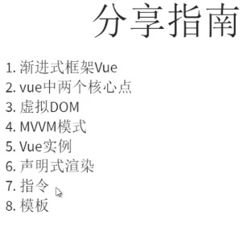
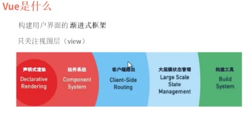
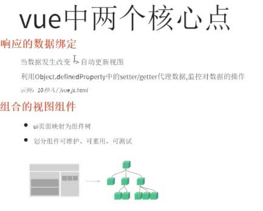
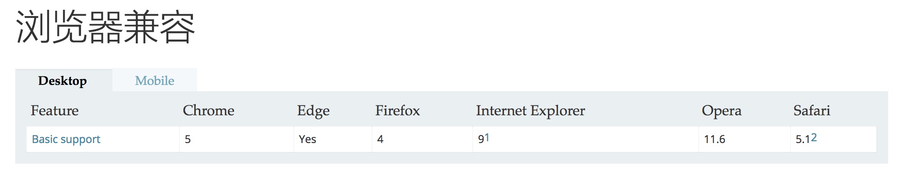
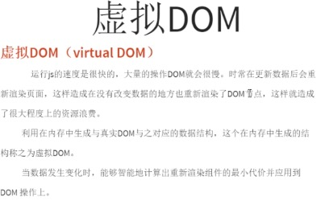
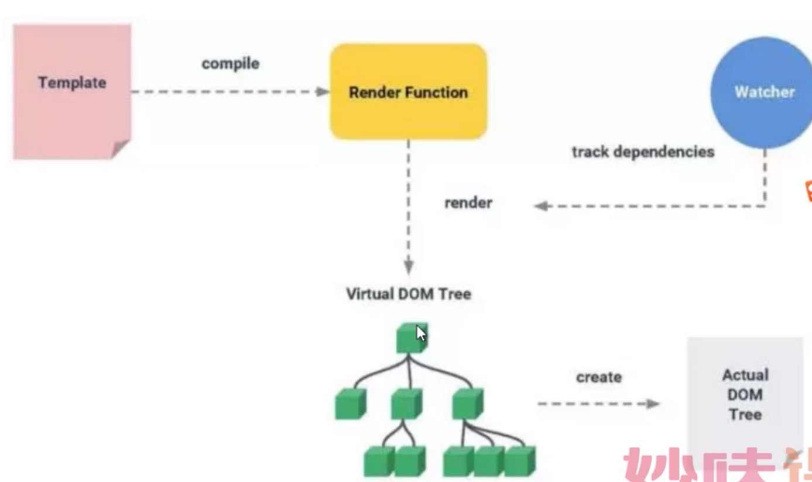
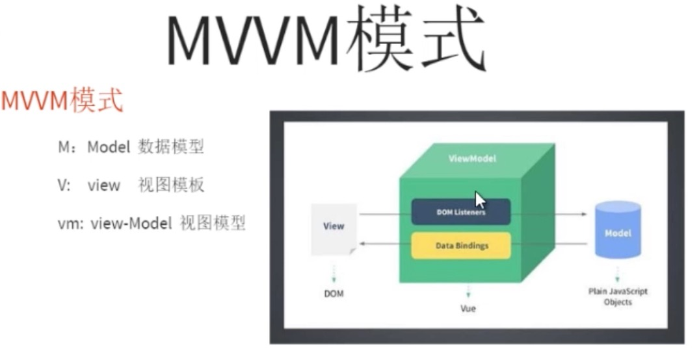
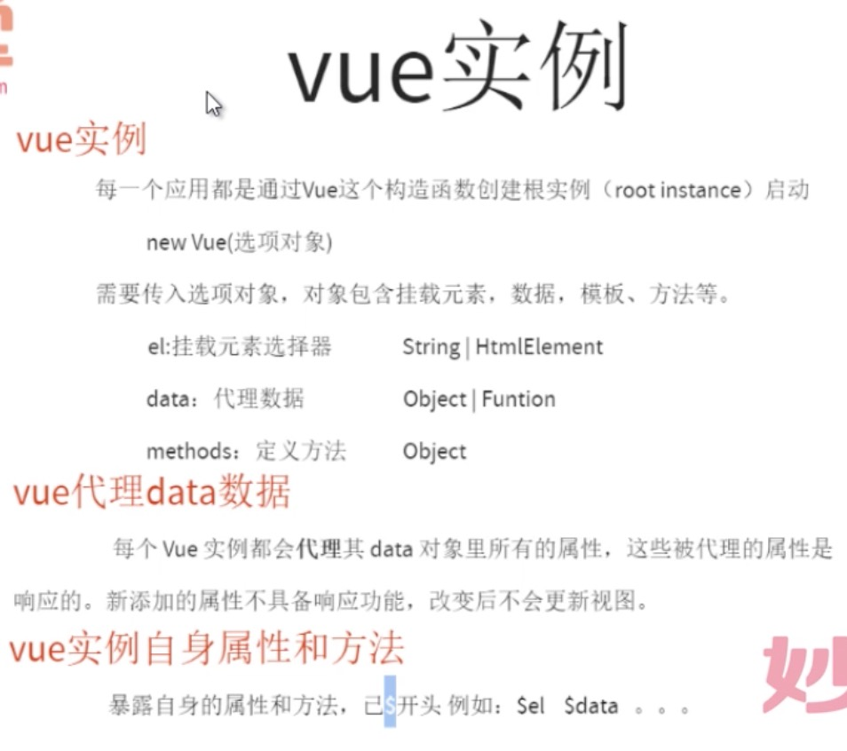
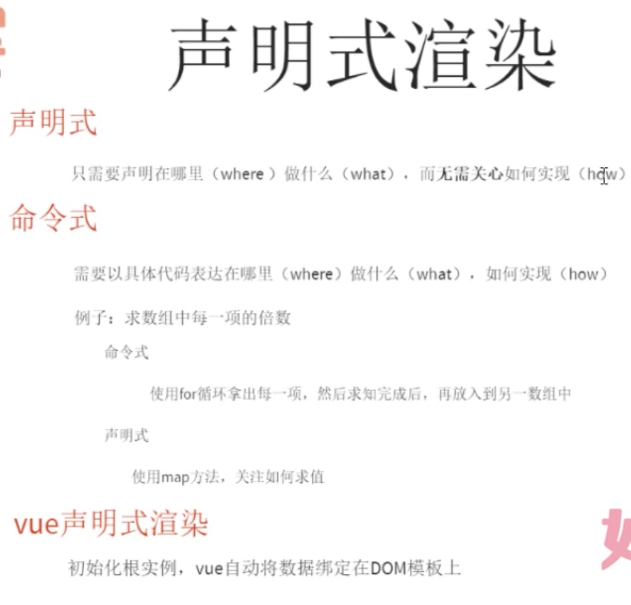

## 01 vue 介绍

###简介

### vue是什么

### vueliangge核心点

[Object.defineProperty()](https://developer.mozilla.org/zh-CN/docs/Web/JavaScript/Reference/Global_Objects/Object/defineProperty) 方法会直接在一个对象上定义一个新属性，或者修改一个对象的现有属性， 并返回这个对象。

### 虚拟DOM 

### mvvm 模式

### vue实例

    
    
    
 
    	{{message}}
    

    
    

### 声明式渲染

