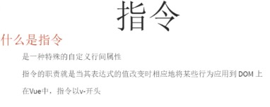
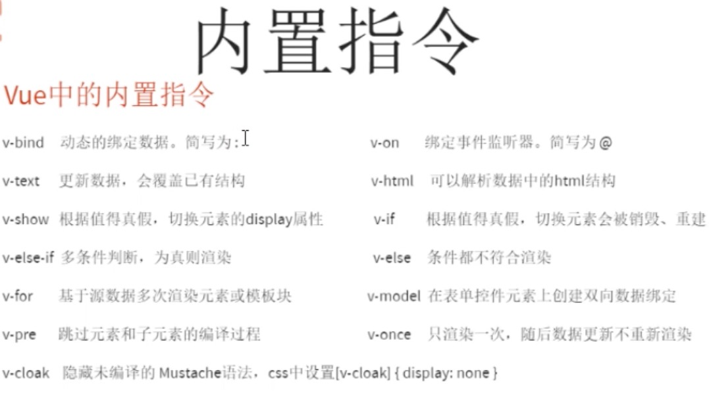
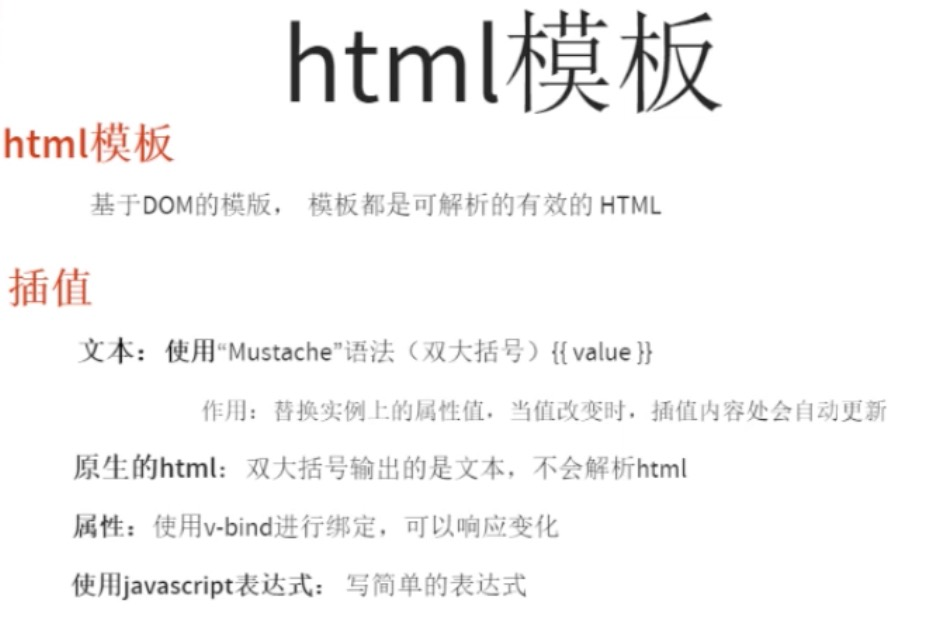
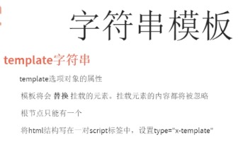
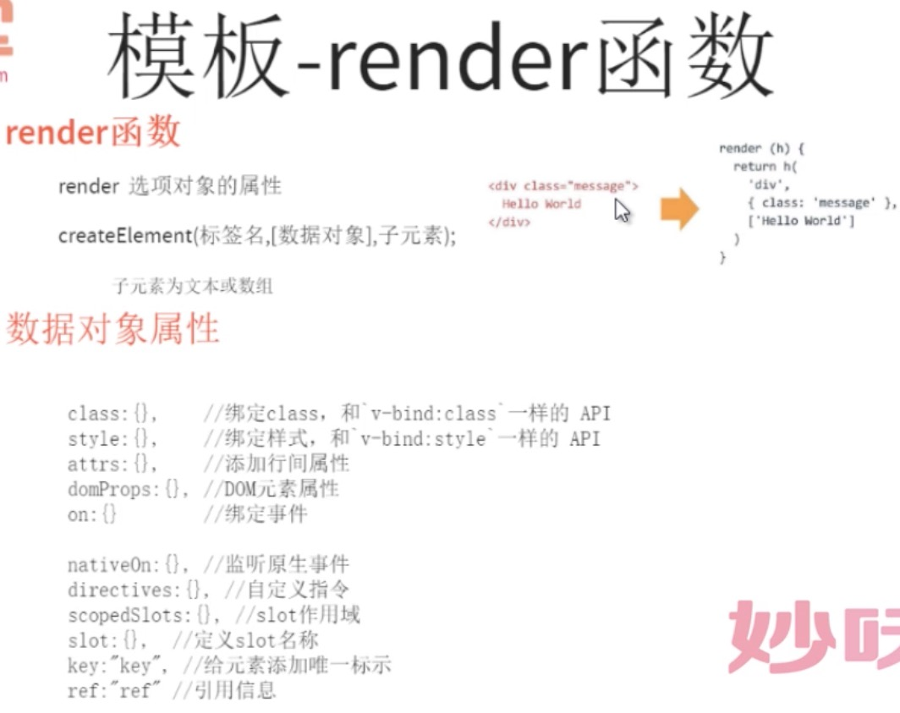

## 02.指令和模版

- 指令
- 模版
    - html 模版
    - 字符串模版
    - render 模版

### 指令

[vue的具体指令](https://cn.vuejs.org/v2/api/#指令)

* v-text
* v-html
* v-show
* v-if
* v-else
* v-else-if
* v-for
* v-on
* v-bind
* v-model
* v-pre
* v-cloak
* v-once

## 模版
### html 模版 

    
    
    
 
        {{1+2}}  
	    {{ true ? 'yes' : 'no'}} 
    	

    

    
    

### 字符串模版 （template）

    
    
    

    	asdasdasda //span会被替换
    

    
    
    

    
    
    

    	asdasdasda
    

    
    
    
    

### render 模版

    
    
    

 
    
    
