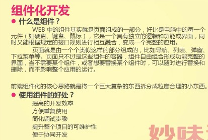
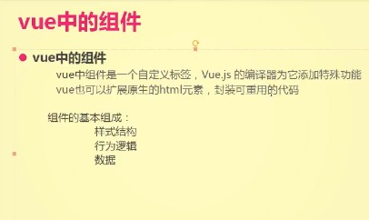
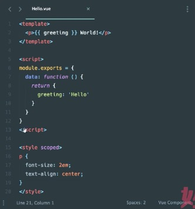
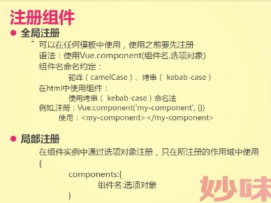

# 组件化

一个页面里面可以出现多个Vue

    <body>
      

      

      
    </body>

### 组件化开发

### vue中组件化

单文件组件

### 组册组件
  - 命名约定
    - 组件定义时候命名
    - 组件使用时候命名
  - 全局注册

        // 全局注册
        Vue.component('my-component', {
          template: '
A custom component!
'
        })

        //局部注册
        var Child = {
          template: '
A custom component!
'
        } 
        new Vue({
          // ...
          components: {
            // <my-component> 将只在父组件模板中可用
            'my-component': Child
          }
        })

  - 局部注册

