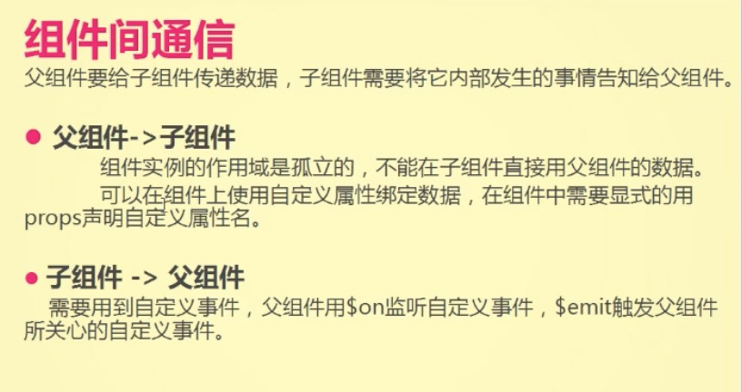
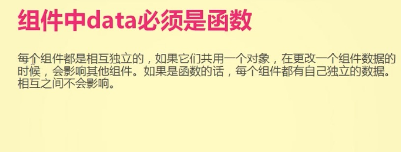
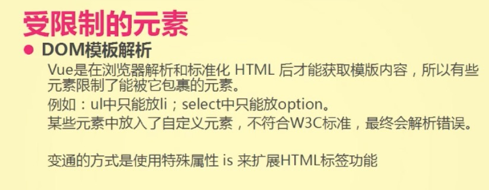
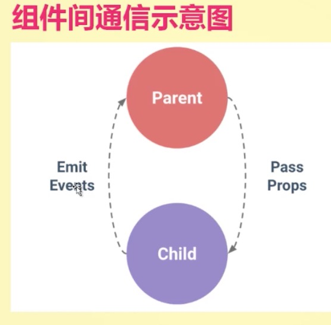
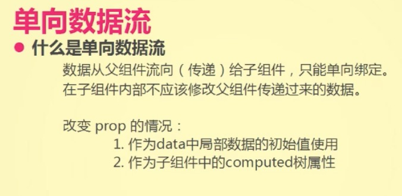
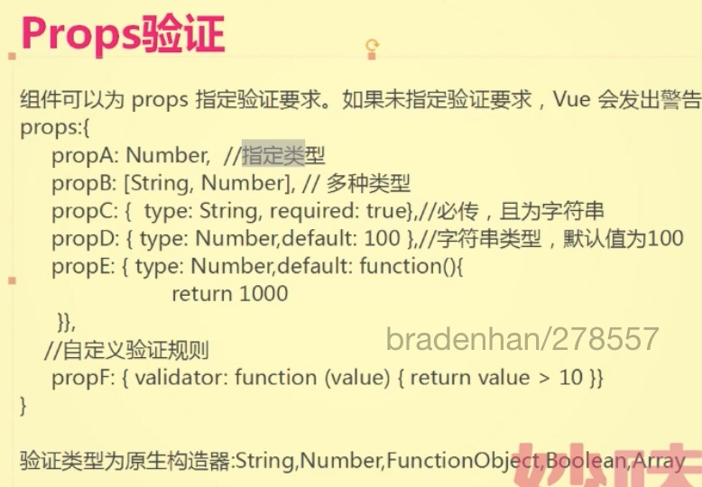
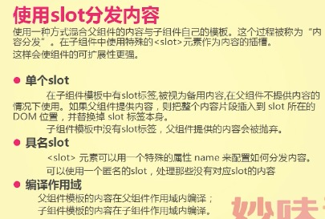

# 组件化

- 组件化开发概念
- vue中组件化
- 注册组件
  - 全局注册
  - 局部注册
- 组件之间的通信
  - 父组件 --> 子组件
    props
  - 子组件 --> 父组件
    $on $emit
  - 组件的data必须为函数
  - 受限制元素
- 组件间通信示意图
- 单向数据流
- props验证
- 使用slot分发内容
  - 单个slot
  - 具名slot
  - 编译作用域
- 封装组件

一个页面里面可以出现多个Vue

    <body>
      

      

      
    </body>

### 组件化开发

### vue中组件化

单文件组件

### 组册组件
  - 命名约定
    - 组件定义时候命名
    - 组件使用时候命名
  - 全局注册

        // 全局注册
        Vue.component('my-component', {
          template: '
A custom component!
'
        })

        //局部注册
        var Child = {
          template: '
A custom component!
'
        }
        new Vue({
          // ...
          components: {
            // <my-component> 将只在父组件模板中可用
            'my-component': Child
          }
        })

  - 局部注册

### 组件之间通信

  - 父组件 --> 子组件

        组件注册
        Vue.component('child', {
          // 声明 props
          props: ['messageData'],
          // 就像 data 一样，prop 也可以在模板中使用
          // 同样也可以在 vm 实例中通过 this.message 来使用
          template: '{{ messageData }}'
        })

        组件使用
        <child message-data="hello!"></child>

- 子组件 --> 父组件

      使用$emit()触发父组件中自定义的事件。

      

    		<h3>父组件中使用了count</h3>
    		{{count}}
    		<custom-compont :count="count" @increment-click="countHandel"></custom-compont>
    	

    	

  ####  [props](https://cn.vuejs.org/v2/guide/components.html#Prop) 属性

  - 类型：Array<string> | Object

  - 详细：

    props 可以是数组或对象，用于接收来自父组件的数据。props 可以是简单的数组，或者使用对象作为替代，对象允许配置高级选项，如类型检测、自定义校验和设置默认值。

  - 示例：

        // 简单语法
        Vue.component('props-demo-simple', {
          props: ['size', 'myMessage']
        })

        // 对象语法，提供校验
        Vue.component('props-demo-advanced', {
          props: {
            // 检测类型
            height: Number,
            // 检测类型 + 其他验证
            age: {
              type: Number,
              default: 0,
              required: true,
              validator: function (value) {
                return value >= 0
              }
            }
          }
        })

 #### 组件的data必须为函数：

 

 #### 受限制元素

 

 必须遵循HTML元素嵌套规则，可以用特殊属性is来扩展HTML标签功能

 [DOM 模板解析注意事项](https://cn.vuejs.org/v2/guide/components.html)

  当使用 DOM 作为模板时 (例如，使用 el 选项来把 Vue 实例挂载到一个已有内容的元素上)，你会受到 HTML 本身的一些限制，因为 Vue 只有在浏览器解析、规范化模板之后才能获取其内容。尤其要注意，像

    <ul>、
    <ol>、
    <table>、
    <select>

  这样的元素里允许包含的元素有限制，而另一些像

    <option>

  这样的元素只能出现在某些特定元素的内部。

  在自定义组件中使用这些受限制的元素时会导致一些问题，例如：

      <table>
        <my-row>...</my-row>
      </table>

  自定义组件 <my-row> 会被当作无效的内容，因此会导致错误的渲染结果。变通的方案是 **使用特殊的 is 特性** ：

    <table>
      <tr is="my-row"></tr>
    </table>

  **应当注意，如果使用来自以下来源之一的字符串模板，则没有这些限制:**

    

####  具名slot

    

      <h3>自定义组件</h3>
      <custom>
        <!-- 当写在自定义标签之间的内容，要混合子组件中的模版 -->

        
替换这是第1个提醒

        
替换这是第2个提醒

        
替换这是第3个提醒

        
替换这是第2个提醒

        <template slot="two">
          
替换这是第2个提醒

          
替换这是第2个提醒

          
替换这是第2个提醒

          
替换这是第2个提醒

          
替换这是第2个提醒

        </template>
      </custom>
    

    

#### 编译作用域：
- 父组件模版的内容在父组件作用域内编译
- 子组件模版的内容在子组件作用域内编译

      

        <h3>自定义组件</h3>
        <custom>
            <!-- 渲染的数据是父组件中的数据 -->
            {{message}}
        </custom>
      

      

### 封装组件

