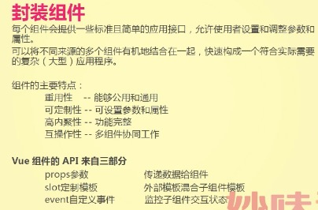
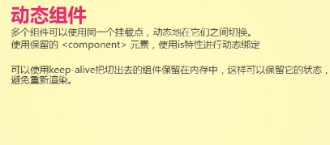

# 封装组件

### 封装modal组件

1. 考虑组件需要暴露出的属性

    /*
        设置的props：
            modalTitle 提醒信息 默认为 '这是一个模态框'

        定制模板：
            slot为modal-content  定制提醒信息模板
            slot为modal-footer   定制底部模板

        监控子组件状态变化：
            事件名on-ok        点击确定触发
            事件名on-cancel   点击取消触发
    */

2. 组件定义

    

3. 调用组件

    

      <model modal-title = "提醒" @on-ok="onOk" @on-cancel="onCancel"></model>

      <model>
        <ul slot="modal-content">
          <li v-for="item of list">
            {{item}}
          </li>
        </ul>
        

          确定
          取消
          返回
        

      </model>

      <model @on-cancel="onCancel"></model>

    

    

### 封装alert组件

  1. 考虑组件需要暴露出的属性

    /*
      alert提醒框有四种状态：
          info success error warning

      设置的props：
        type 提醒框类型 默认为info
        title 提示信息 '这里有一个消息要提示'
        closeable 是否禁用关闭 默认为true
        showicon 是否显示图标 默认为fasle
        style 设置提醒框样式 默认为{}

      定制模板：
        slot为iconTmp  定制icon模板
        slot为titleTmp 定制提示信息结构

      监控状态变化：
        事件名close-click   点击关闭X触发

    */
2. 组件定义

        

3. 调用组件

          

            <m-alert type="info"></m-alert>
            <m-alert
              type="success"
              title="已成功"
              :closeable="false"
              :showicon="true"
            ></m-alert>
            <m-alert type="error">
              <i class="m-icon m-icon-menu" slot="iconTemp"></i>
              <template islot="titleTemp">
                
sss

                
sss

                
sss

              </template>
            </m-alert>
            <m-alert
              type="warning"
              style="background : #333"
              :closeable="false"
              @on-click = "onClickHandel"
            >
                
sss

            </m-alert>
          

          

# 组件递归

  组件内部调用组件

1. 考虑组件需要暴露出的属性

        /*
          传入的数据结构：
            [
            {
              title:XXX,
              children:[
                {
                  title:XXXX,
                  chidren:[]
                }
              ]
            }]

          设置的props：
            data 数据结构 默认为 []

          定制模板:
            不可定制

          监控状态变化：
            事件名on-select-change 点击树节点触发
        */

2. 组件定义

        

3. 调用组件

        

          <tree :data="treeList"></tree>
        

        

### 动态组件

      

        <input type="button" value="切换到第一个组件" @click="tapHande(1)">
        <input type="button" value="切换到第二个组件" @click="tapHande(2)">
        <input type="button" value="切换到第三个组件" @click="tapHande(3)">

        // 注意此处 keep-alive  component  is
        <keep-alive>
            <component :is="current"></component>
        </keep-alive>

      

      
