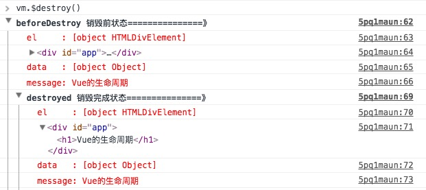
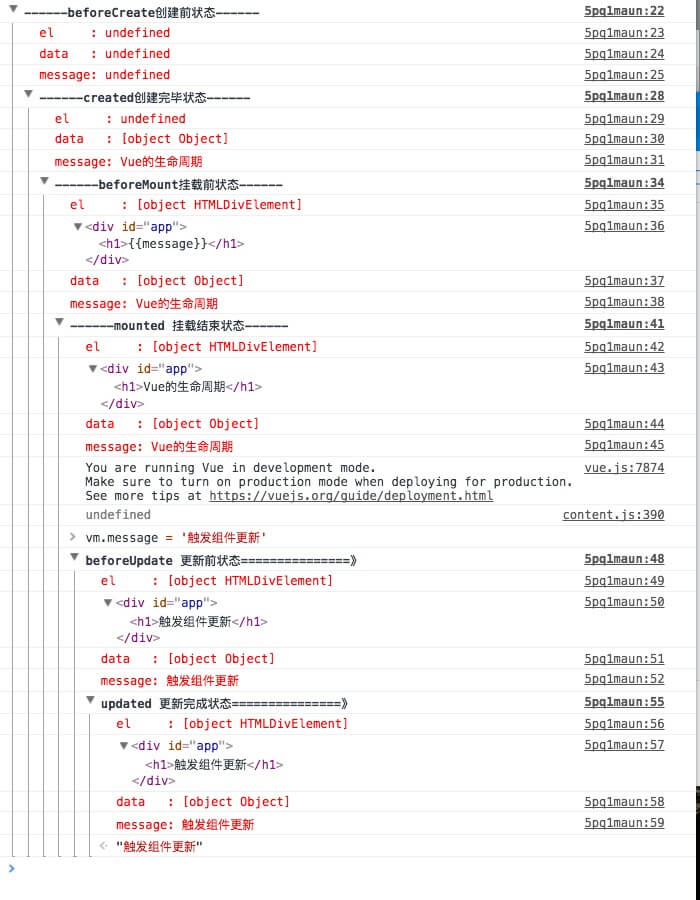

## vue生命周期

每个Vue实例在被**创建**之前都要经过一系列的初始化过程,这个过程就是vue的生命周期

vue一整个的生命周期中会有很多钩子函数提供给我们在vue生命周期不同的时刻进行操作

所有的钩子函数:

* beforeCreate
* created
* beforeMount
* mounted
* beforeUpdate
* updated
* beforeDestroy
* destroyed

        <!DOCTYPE html>
        <html lang="en">
        <head>
          <meta charset="UTF-8">
          <meta name="viewport" content="width=device-width, initial-scale=1.0">
          <meta http-equiv="X-UA-Compatible" content="ie=edge">
          <title>vue生命周期学习</title>
          
        </head>
        <body>
          

            <h1>{{message}}</h1>
          

        </body>
        
        </html>

运行后打开console可以看到打印出来内容如下:

可以看到一个vue实例在创建过程中调用的几个生命周期钩子。

1. 在beforeCreate和created钩子函数之间的生命周期

    在这个生命周期之间，进行初始化事件，进行数据的观测，可以看到在created的时候数据已经和data属性进行绑定（放在data中的属性当值发生改变的同时，视图也会改变）。
注意看下：此时还是没有el选项

2. created钩子函数和beforeMount间的生命周期

    
    
    首先会判断对象是否有**el**选项。如果有的话就继续向下编译，如果没有el选项，则停止编译，也就意味着**停止了生命周期**，直到在该vue实例上调用**vm.$mount(el)**。此时注释掉代码中:
    
        el: '#app',
    
    然后运行可以看到到created的时候就停止了：

    
    
    如果我们在后面继续调用vm.$mount(el),可以发现代码继续向下执行了
    
        vm.$mount(el) //这个el参数就是挂在的dom接点
        
    

    然后，我们往下看，template参数选项的有无对生命周期的影响。

        （1）.如果vue实例对象中有template参数选项，则将其作为模板编译成render函数。
        （2）.如果没有template选项，则将外部HTML作为模板编译。
        （3）.可以看到template中的模板优先级要高于outer HTML的优先级。
    
    修改代码如下, 在HTML结构中增加了一串html，在vue对象中增加了template选项：

        <!DOCTYPE html>
        <html lang="en">
        <head>
          <meta charset="UTF-8">
          <meta name="viewport" content="width=device-width, initial-scale=1.0">
          <meta http-equiv="X-UA-Compatible" content="ie=edge">
          <title>vue生命周期学习</title>
          
        </head>
        <body>
          

            <!--html中修改的-->
            <h1>{{message + '这是在outer HTML中的'}}</h1>
          

        </body>
        
        </html>
        
    执行后的结果可以看到在页面中显示的是：
    

    那么将vue对象中template的选项注释掉后打印如下信息：
    

    这下就可以想想什么el的判断要在template之前了~是因为vue需要通过el找到对应的outer template。

    在vue对象中还有一个render函数，它是以createElement作为参数，然后做渲染操作，而且我们可以直接嵌入JSX.

        new Vue({
            el: '#app',
            render: function(createElement) {
                return createElement('h1', 'this is createElement')
            }
        })
    
    可以看到页面中渲染的是：
      

    所以综合排名优先级：

    **render函数选项** > **template选项** > **outer HTML**.  

    可以看到此时是给vue实例对象添加$el成员，并且替换掉挂在的DOM元素。因为在之前console中打印的结果可以看到beforeMount之前el上还是undefined。
    
3. beforeMount和mounted 钩子函数间的生命周期

    
    
    可以看到此时是给vue实例对象添加$el成员，并且替换掉挂在的DOM元素。因为在之前console中打印的结果可以看到beforeMount之前el上还是undefined。
    
4. mounted

    注意看下面截图：
    
    

    在mounted之前h1中还是通过{{message}}进行占位的，因为此时还有挂在到页面上，还是JavaScript中的虚拟DOM形式存在的。在mounted之后可以看到h1中的内容发生了变化。
    
5. beforeUpdate钩子函数和updated钩子函数间的生命周期
    
    
    当vue发现data中的数据发生了改变，会触发对应组件的重新渲染，先后调用beforeUpdate和updated钩子函数。我们在console中输入：
    
        vm.message = '触发组件更新'

   发现触发了组件的更新：
   
    
    
6. beforeDestroy和destroyed钩子函数间的生命周期

    

    beforeDestroy钩子函数在实例销毁之前调用。在这一步，实例仍然完全可用。
    destroyed钩子函数在Vue 实例销毁后调用。调用后，Vue 实例指示的所有东西都会解绑定，所有的事件监听器会被移除，所有的子实例也会被销毁。
    
    

    最后展示图
    
    
    
    
### 生命周期小结

生命周期钩子的一些使用方法：

* beforecreate : 可以在这加个loading事件，在加载实例时触发 
* created : 初始化完成时的事件写在这里，如在这结束loading事件，异步请求也适宜在这里调用
* mounted : 挂载元素，获取到DOM节点
* updated : 如果对数据统一处理，在这里写上相应函数
* beforeDestroy : 可以做一个确认停止事件的确认框
* nextTick : 更新数据后立即操作dom
